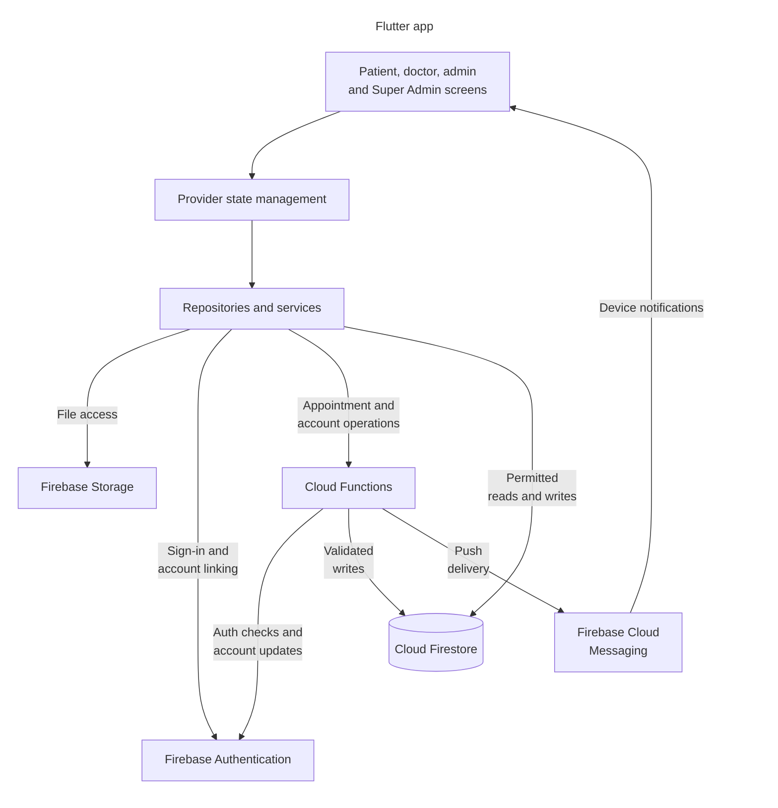

<div align="center">

# University Health Center (UHC)

Healthcare Appointment & Management Platform

[](https://flutter.dev)
[](https://firebase.google.com)
[](https://dart.dev)
[](LICENSE)

[](android)
[](ios)
[](web)
[](lib/l10n)

</div>

---

## Table of Contents

- [Overview](#overview)
- [Key Features](#key-features)
- [Architecture & Tech Stack](#architecture--tech-stack)
- [Project Structure](#project-structure)
- [Getting Started](#getting-started)
- [Firebase Configuration](#firebase-configuration)
- [Cloud Functions](#cloud-functions)
- [User Roles & Permissions](#user-roles--permissions)
- [Super Admin Bootstrap](#super-admin-bootstrap)
- [Building for Production](#building-for-production)
- [Configuration Reference](#configuration-reference)
- [Changelog](#changelog)
- [Contributing](#contributing)
- [License](#license)
- [Support](#support)

---

## Overview

UHC is a Flutter application for university health centers. Students and staff can book medical appointments. Doctors manage appointments, view schedules, and record QR-verified check-ins. Admins handle daily operations, while Super Admins manage roles, permissions, Super Admin slots, and audit logs. Firebase provides the backend.

### At a glance

| Area | Support |
|---|---|
| **Multilingual** | English, Arabic, and Kurdish resources with RTL layouts; admin and Super Admin screens currently use English/LTR |
| **Data access** | Cursor-paginated Firestore queries, scheduled push delivery, parallel fetching, and composite indexes |
| **Access control** | Role-based access control with server-side Cloud Functions for privileged operations |
| **Interface** | Material Design 3, animations, dark mode, and responsive layouts |
| **Cross-Platform** | Single codebase for Android, iOS, and Web |

---

## Key Features

<details>
<summary><b>Patient Portal</b></summary>

- **Authentication**. Email/password, Google Sign-In, and password recovery. Accounts must link Google before accessing protected backend services.
- **Appointment Booking**. Browse by department or doctor, pick available time slots, and confirm bookings; unavailable or inactive doctors are locked in the UI and rejected by the backend
- **Appointment Management**. View upcoming/past appointments, reschedule, or cancel with reason tracking
- **Medical Documents**. Upload and organize lab results, prescriptions, and imaging reports
- **Push Notifications**. FCM push, local mobile reminders, and in-app notification center with visibility-safe scheduled alerts
- **Profile Management**. Edit personal info, change password, upload profile photo
- **QR Code**. Generate QR codes for appointments
- **Dark Mode**. System-aware or manual theme toggle

</details>

<details>
<summary><b>Doctor Dashboard</b></summary>

- **Dashboard Overview**. Daily stats (patients, appointments, completed, pending) and upcoming appointments
- **Appointment Management**. View upcoming and past appointments with patient details and status badges
- **QR-Verified Check-In**. Camera-based confirmation from 5 minutes before to 10 minutes after the appointment; see the check-in limitation below
- **Schedule View**. Week, two-week, and month calendars with daily booked, available, and past slots; admins configure weekly working hours
- **Appointment Details**. Full appointment view with patient info, medical notes editor, and action buttons (confirm, complete, cancel, no-show)
- **Patient Profiles**. View patient details, profile photos, medical info, and appointment history from within appointment context
- **Doctor Profile & Settings**. Edit specialization, bio, qualifications; configure notifications, language, and theme
- **Availability Requests**. Request unavailable status with a note for admin approval, stay available while pending, and sync the dashboard switch in real time when admin changes availability
- **Push Notifications**. Real-time alerts for new bookings, cancellations, status changes, and configurable daily schedule summaries

</details>

<details>
<summary><b>Admin Console</b></summary>

- **Dashboard**. User, doctor, and appointment counts, including pending, completed, and today's appointments; loaded on entry or refresh
- **Department Management**. Create departments with custom color, icon (155+ options), and per-day working hours
- **Doctor Management**. Full CRUD with schedule constraints, active/inactive filters, visible availability badges, and admin controls to make doctors available or unavailable
- **Doctor Availability Review**. High-priority availability request notifications let doctor-managing admins approve or reject unavailable requests
- **User Management**. View all users with role-safe controls and account status management
- **Permission-Aware UI**. Admin actions are gated by granular permission keys (`users.manageNonAdmin`, `doctors.manage`, `departments.manage`, etc.)
- **Analytics**. Interactive charts for appointment trends and department performance
- **Reports**. Export XLSX reports for appointments, doctors, users, and departments (permission-gated)
- **Permission-Safe Dashboard**. KPI stats display zero when the admin lacks the corresponding view permission
</details>

<details>
<summary><b>Super Admin Governance</b></summary>

- **Super Admin Shell**. Separate governance screens for web and mobile
- **Super Admin Slots**. Primary and backup slots with transactional occupancy checks; both should be filled during setup
- **Admin Governance Actions**. Create admin, promote/demote roles, activate/deactivate, reset password, delete admin, force sign-out
- **Permissions Matrix**. Per-admin permission assignment with Full, Ops, Read-Only, and Off presets
- **Audit Logs**. Filterable governance audit trail by actor, target, action, and date
- **Server-Side Access Checks**. Sensitive mutations moved to Cloud Functions; Firestore rules block client-side privilege escalation
</details>

<details>
<summary><b>Supported Departments</b></summary>

| Department | Department |
|:---|:---|
| General Medicine | Orthopedics |
| Pediatrics | Laboratory |
| Dermatology | Radiology |
| Psychiatry | Cardiology |
| Rehabilitation | Pharmacy |

> These are example departments, not a guaranteed database inventory. Configure departments through the admin console with custom icons, colors, and working hours.

</details>

---

## Architecture & Tech Stack

### Technology Overview

| Layer | Technology | Purpose |
|:---|:---|:---|
| **Framework** | Flutter / Dart | Cross-platform UI toolkit; see the SDK requirements below |
| **State Management** | Provider | Reactive state with ChangeNotifier |
| **Authentication** | Firebase Auth, Google Sign-In | Email/password and Google Sign-In |
| **Database** | Cloud Firestore | Real-time NoSQL document database |
| **File Storage** | Firebase Storage | Medical document & image hosting |
| **Messaging** | Firebase Cloud Messaging | Push notifications |
| **Server Logic** | Firebase Cloud Functions (TypeScript) | Privileged admin operations |
| **Local Storage** | SharedPreferences | User preferences & theme persistence |
| **Notifications** | flutter_local_notifications | Scheduled local reminders |
| **UI Framework** | Material Design 3, Google Fonts | App styling and typography |
| **Animations** | Lottie, flutter_animate | Onboarding and UI animations |
| **Charts** | fl_chart | Admin analytics & dashboards |
| **Calendar** | table_calendar | Date selection for appointments |
| **QR Codes** | qr_flutter, mobile_scanner | Patient QR generation & doctor-side scanning |
| **Excel Reports** | Syncfusion Flutter XlsIO | Styled XLSX report generation |
| **Localization** | ARB files, flutter_localizations | EN / AR / KU and RTL support; admin and Super Admin screens use English/LTR |

### Application Architecture



Firestore and Storage rules control direct client access. Cloud Functions validate callers and permissions for privileged operations. Mobile reminders are scheduled locally by the app; web uses push and in-app notifications.

---

## Project Structure

```text
uhc/
├── lib/
│   ├── main.dart                   # App initialization
│   ├── core/                       # Shared widgets, themes, constants, locale helpers
│   ├── data/
│   │   ├── models/                 # Users, doctors, appointments, departments, notifications
│   │   └── repositories/           # Firestore data access
│   ├── l10n/                       # EN / AR / KU resources and generated localizations
│   ├── providers/                  # Provider state management
│   ├── screens/
│   │   ├── auth/                   # Login, Google linking, password setup and recovery
│   │   ├── patient/                # Booking, appointments, documents, profile
│   │   ├── doctor/                 # Appointments, schedule view, profile, QR scanner
│   │   ├── admin/                  # Operations, analytics, reports
│   │   ├── super_admin/            # Governance, permissions, audit logs
│   │   └── shared/                 # Notifications and account settings
│   ├── services/                   # Auth, messaging, reminders, callable wrappers
│   └── utils/                      # File saving and platform helpers
├── functions/src/
│   ├── index.ts                    # Public function exports
│   ├── firebase.ts                 # Firebase Admin initialization
│   ├── appointments.ts             # Appointment lifecycle
│   ├── doctors.ts                  # Doctor accounts, profiles, schedules
│   ├── users.ts                    # Student/staff accounts and setup
│   ├── departments.ts              # Department operations
│   ├── doctorAvailability.ts       # Availability requests and review
│   ├── admin.ts                    # Super Admin governance
│   ├── notifications/              # Delivery, admin sends, scheduled jobs
│   └── shared/                     # Auth guards, audit logs, validation
├── test/                           # Widget, security regression, notification theme tests
├── assets/                         # Images, animations, icons
├── android/                        # Android runner and configuration
├── ios/                            # iOS runner and configuration
├── web/                            # Web runner and messaging service worker
├── docs/                           # Setup, function reference, bootstrap runbook
├── CHANGELOG.md                    # Release history
├── firebase.json                   # Firebase deployment configuration
├── firestore.rules                 # Firestore access rules
├── storage.rules                   # Upload and file access rules
├── firestore.indexes.json          # Composite indexes
└── pubspec.yaml                    # App dependencies and metadata
```

---

## Getting Started

### Prerequisites

| Requirement | Version |
|:---|:---|
| Flutter SDK | A stable release that satisfies both SDK constraints below |
| Locked SDK constraints | Flutter >=3.38.4 and bundled Dart >=3.11.0, <4.0.0 |
| Node.js | 22, matching the Functions runtime in `firebase.json` |
| Firebase CLI | 15.19.0, the version used to check the deployment flags below |
| FlutterFire CLI | Required to generate the Firebase app configuration |
| Android Studio / Xcode | Android tooling for Android builds; macOS and Xcode for iOS builds |

The resolved dependencies in `pubspec.lock` require newer SDKs than the minimum declared in `pubspec.yaml`. Check `flutter --version` and use a Flutter release whose bundled Dart also meets the locked constraints.

### Quick Start

Clone the repository and install the app and backend dependencies:

```bash
git clone https://github.com/ELYASDARK/UHC.git
cd UHC
flutter pub get
npm --prefix functions ci
npm --prefix functions run build
```

Complete [Firebase setup](docs/FIREBASE_SETUP.md), including Google Sign-In and platform notification configuration, before launching the app. The repository's existing configuration belongs to its original project.

```bash
flutter gen-l10n
flutter run
```

### Cloud Functions Setup

For subsequent backend changes, rebuild from the repository root. Select the Firebase project and complete the platform setup before validation or deployment.

```bash
npm --prefix functions run build

# Validate rules, indexes, storage rules, and functions packaging without deploying
firebase deploy --only 'firestore:rules,firestore:indexes,storage,functions' --dry-run

# Deploy functions to Firebase after validation
firebase deploy --only functions
```

The Firebase dry run may enable required APIs on the selected project, even though it does not deploy the app's resources.

---

## Firebase Configuration

UHC uses Firebase Authentication, Firestore, Storage, Cloud Messaging, Cloud Functions, and Cloud Scheduler. Configure your own Firebase project before running the app.

Follow the [Firebase setup guide](docs/FIREBASE_SETUP.md) for project selection, platform configuration, deployment, email settings, and the Firestore collection reference.

---

## Cloud Functions

Cloud Functions handle appointment operations, account management, availability requests, notifications, and Super Admin governance. Protected operations require an active account with a linked Google provider and the relevant permissions.

See the [Cloud Functions reference](docs/CLOUD_FUNCTIONS.md) for the full function list, access requirements, and Google-linking troubleshooting.

---

## User Roles & Permissions

| Role | Capabilities |
|:---|:---|
| **Student** | Book/manage appointments, upload documents, view own records |
| **Staff** | The patient portal for campus staff, with the same capabilities as students |
| **Doctor** | View assigned appointments and schedules, record check-ins and notes, and request availability changes |
| **Admin** | Permission-scoped operations (view/manage non-admin users, doctors, departments, analytics, reports, notifications) |
| **Super Admin** | Full admin powers + admin governance, slot management (`primary`/`backup`), permissions control, audit log access |

> Admin actions require assigned permissions. Super Admin bypasses the granular admin permission map; caller and operation-specific checks still apply.

---

## Super Admin Bootstrap

Use the [bootstrap runbook](docs/SUPER_ADMIN_BOOTSTRAP_RUNBOOK.md) for the complete procedure and recovery guidance.

Quick bootstrap summary:

Use manual promotion only when the primary slot is empty. If it is occupied, follow the runbook's slot replacement workflow.

1. Create or sign in to the target account and link its Google account. The backend checks the linked provider in Firebase Authentication.
2. Ensure Firestore profile document exists at `users/{authUid}` (document ID must equal Auth UID).
3. In Firebase Console, set these fields on the profile:
   - `role: "superAdmin"`
   - `superAdminType: "primary"`
   - `isActive: true`
   - `requiresInitialPasswordChange: false`, after completing any required initial password change
4. Sign out, sign in again, and verify that the app opens `SuperAdminShell`.
5. Verify the backup account is active and Google-linked, then assign its slot through the Super Admin UI or `assignSuperAdminSlot`.

---

## Building for Production

From the repository root, run the checks used by CI and compile the backend:

```bash
flutter analyze
flutter test
npm --prefix functions run build
```

Use your production app identifiers, Firebase project, and signing configuration before creating a release build. The commands below compile release artifacts; they do not configure signing or publish to an app store.

```bash
# Android
flutter build apk --release          # APK
flutter build appbundle --release     # AAB (Play Store)

# iOS
flutter build ios --release

# Web
flutter build web --release
```

---

## Configuration Reference

| File | Purpose |
|:---|:---|
| `lib/core/constants/app_colors.dart` | Color scheme & palette |
| `lib/core/constants/app_strings.dart` | App-wide string constants |
| `lib/core/constants/app_assets.dart` | Asset path references |
| `lib/core/theme/` | Material 3 light & dark theme definitions |
| `l10n.yaml` | Localization generation config |
| `firestore.rules` | Firestore security rules |
| `firestore.indexes.json` | Composite index definitions |

### Known limitations

- The doctor UI offers manual confirmation after five failed scans, but the backend rejects confirmation through `updateAppointmentStatus`. QR check-in remains the supported confirmation path. See the [appointment reference](docs/CLOUD_FUNCTIONS.md#appointment-lifecycle).
- Web push needs project-specific VAPID configuration; the current token helper does not pass a VAPID key. See [Web notification setup](docs/FIREBASE_SETUP.md#web-notifications).
- Build commands alone do not verify sign-in, push delivery, or production capacity. Test those flows against your configured Firebase project before handoff.

---

## Changelog

See [CHANGELOG.md](CHANGELOG.md) for release history, implementation notes, and the files changed in each release.

---

## Contributing

1. **Fork** the repository
2. **Create** your feature branch
   ```bash
   git checkout -b feature/your-change
   ```
3. **Commit** your changes with a descriptive message
   ```bash
   git commit -m "Describe your change"
   ```
4. **Push** to your branch
   ```bash
   git push origin feature/your-change
   ```
5. **Open** a Pull Request

> Please ensure your code follows the project's lint rules (`flutter analyze`) and includes appropriate tests.

---

## License

This project is licensed under the **MIT License**. See the [LICENSE](LICENSE) file for details.

---

## Support

- Email: [aleaskamil1234@gmail.com](mailto:aleaskamil1234@gmail.com)
- Issues: [Open an issue](https://github.com/ELYASDARK/UHC/issues)

---

<div align="center">

*University Health Center © 2026*

</div>
